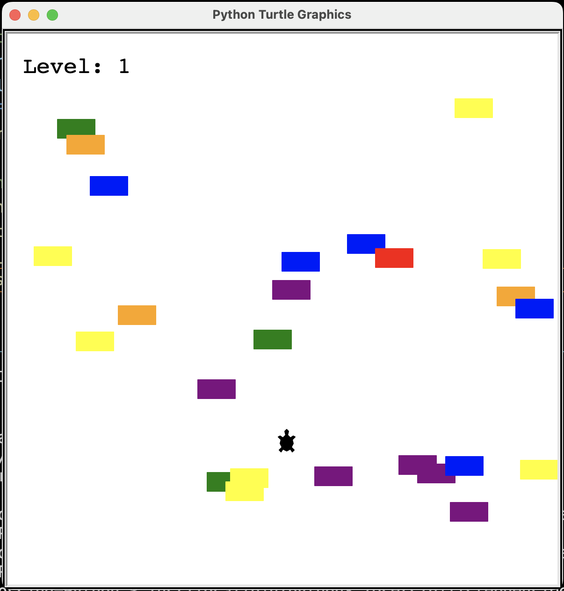

# Turtle Crossing 

  ## Description

  This is a game built using Python which is similar to the classic Frogger game.  The object of the game is to move the turtle from the bottom of the screen to the top of the screen without being hit by a car.

  Screenshot:

  
  
  ## Table of Contents
  
  - [Installation](#installation)
  - [Usage](#usage)
  - [License](#license)
  - [Contributing](#contributing)
  - [Tests](#tests)
  - [Questions](#questions)
  
  ## Installation
  
  run main.py in terminal
  
  ## Usage
  
  move turtle from bottom of the screen to the top of the screen using the 'up' key. If successful, player will level up and cars will increase in speed.  Continue playing  until hit by car.

  ## License
This application is covered under the MIT License.
 For more information: https://opensource.org/licenses/MIT
  
  ## Contributing
  N/A
  
  ## Tests
  N/A

  ## Questions
  Contact Info 
  GitHub user name: BillStephens2022 
  Link to GitHub profile: https://github.com/BillStephens2022 
  Email: stephensbill17@gmail.com
